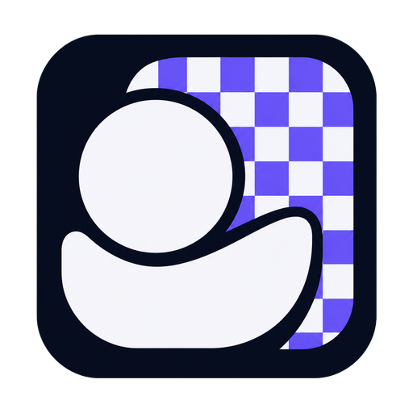
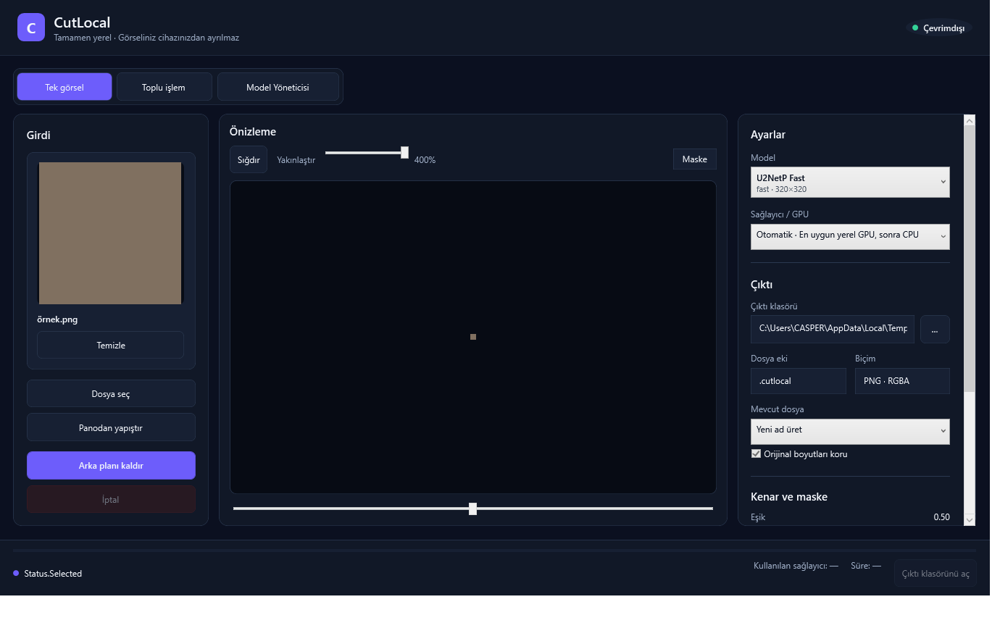

<div align="center">



# CutLocal

**Private, local background removal for Windows and macOS. No cloud inference, Python runtime, account, or telemetry.**

[](#platform-support)
[](https://github.com/maliboz/CutLocal/actions/workflows/ci.yml)
[](https://dotnet.microsoft.com/)
[](LICENSE)
[](#privacy-and-network-behavior)

[Download](#download-and-install) · [Build](#build-from-source) · [Contribute](CONTRIBUTING.md) · [Türkçe](README.tr.md)

</div>

CutLocal is an open-source desktop application that removes image backgrounds
on the user's computer. ONNX Runtime executes inside the application process,
and the generated alpha mask is applied to the original-resolution pixels. The
production application does not call Python, start rembg, use a local HTTP
server, upload images, or collect product analytics.



> **Release status:** CutLocal 0.1.5 is a public-preview candidate. The source,
> automated tests, Windows packages, and macOS archive structure have been
> validated, and the macOS first-launch recovery path has been exercised on a
> real Mac. This does not prove that every image, GPU, driver, locale, or hardware
> combination is defect-free. Read [Known limitations](#known-limitations) and
> report reproducible problems through the issue tracker.

## Why CutLocal

- Image decode, inference, mask refinement, and export happen locally.
- Windows and macOS release archives are self-contained; end users do not install
  Python or a separate .NET runtime.
- Output dimensions match the input dimensions. A model's `320×320` or
  `1024×1024` tensor size affects mask detail, not the output canvas size.
- Model downloads are manifest-driven and require an exact byte length and
  SHA-256 match before activation.
- Bounded queues, cancellation, atomic outputs, crash recovery, and controlled
  native-resource lifetimes reduce failure risk during long-running work.
- Licensing for CutLocal code, dependencies, and each model weight is tracked
  separately instead of treating a repository license as a blanket model grant.

## Platform support

| Platform | Interface | Inference providers | Distribution | Current status |
|---|---|---|---|---|
| Windows 10/11 x64 | WPF | CPU, DirectML with CPU fallback | Per-user MSI, portable ZIP | Primary and most extensively tested |
| macOS 14+ Apple Silicon | Avalonia | CPU | Self-contained `.app` in `.tar.gz` | Preview, unsigned and not notarized |
| macOS 14+ Intel | Avalonia | CPU | Self-contained `.app` in `.tar.gz` | Preview, unsigned and not notarized |

The Windows and macOS interfaces share the same domain, persistence, imaging,
model-validation, and ONNX inference core. DirectML is Windows-only.

## Features

### Image workflow

- Single-image and bounded batch processing for PNG files
- Drag and drop, file/folder selection, and clipboard paste on Windows
- Before/after comparison, mask view, fit, zoom, and pan
- Threshold, feather, hard-cut, inversion, and edge controls
- Original-size transparent RGBA PNG output
- Collision-safe names, Unicode paths, long-path handling, and atomic writes
- Pause, resume, cancel, retry-failed, and interrupted-job recovery
- English and Turkish Windows resources and high-DPI-aware presentation

### Runtime and reliability

- In-process ONNX Runtime through the `OrtValue` API
- CPU baseline and Windows DirectML device discovery
- One controlled CPU retry after eligible GPU device-loss or out-of-memory errors
- Reused warmed sessions with bounded cache ownership
- Deferred image decoding, bounded work queues, and pooled mask/tensor storage
- Hash-verified model download, repair, removal, and custom ONNX import
- Local structured logs without image content or automatic upload

### Release engineering

- Self-contained .NET 10 releases with native dependencies kept in their stable
  probing layout
- WiX per-user MSI and portable ZIP for Windows x64
- Separate Apple Silicon and Intel macOS archives with preserved Unix modes
- SHA-256 sums, per-file release manifests, package validation, dependency audit,
  and third-party notice validation
- Optional Windows Authenticode signing and GitHub artifact attestation

## Download and install

Use only artifacts from this repository's GitHub Releases page. Verify the
published checksum before accepting an operating-system warning.

### Windows MSI

1. Download `CutLocal-<version>-win-x64-setup.msi` and `SHA256SUMS.txt` from the
   [latest release](https://github.com/maliboz/CutLocal/releases/latest).
2. Verify the MSI:

   ```powershell
   Get-FileHash .\CutLocal-0.1.5-win-x64-setup.msi -Algorithm SHA256
   Get-Content .\SHA256SUMS.txt
   ```

3. Run the MSI. It installs for the current user under
   `%LOCALAPPDATA%\Programs\CutLocal`; administrator rights are not required.
4. If Windows displays **Unknown publisher**, continue only when the checksum
   matches and you trust the release source. Unsigned builds are labeled as such.

Uninstall removes application files and shortcuts. It deliberately preserves
models, settings, logs, and recovery state under `%LOCALAPPDATA%\CutLocal`.

### Windows portable ZIP

Download `CutLocal-<version>-win-x64-portable.zip`, verify it, and extract the
entire archive before running `CutLocal.exe`. Do not run the executable from
inside the ZIP or move it away from the adjacent native runtime files.

### macOS archive

Choose the correct package:

- Apple M-series processor: `CutLocal-<version>-macos-arm64.tar.gz`
- Intel processor: `CutLocal-<version>-macos-x64.tar.gz`

The current community packages are not Apple Developer ID signed or notarized.
For the first launch:

1. Double-click the `.tar.gz` file to extract it completely.
2. Open **Terminal** yourself with Spotlight. Do not double-click the included
   `.command` file in Finder.
3. Type `/bin/bash `, including the trailing space.
4. Drag `FIX-CUTLOCAL.command` from the extracted folder into Terminal.
5. Press Enter. The readable script validates the adjacent `CutLocal.app`,
   removes quarantine only from that bundle, applies a local ad-hoc signature,
   verifies it, and launches the app.
6. After a successful launch, move `CutLocal.app` to Applications.

If the script fails, keep the Terminal output and include it in a sanitized bug
report. Never run a first-launch script from a source you do not trust.

## Quick use

1. Open the single-image or batch workspace.
2. Select or drop a PNG file.
3. Keep provider selection on Automatic unless diagnosing Windows GPU behavior.
4. Select a model and output folder.
5. Adjust mask controls only when the default result needs refinement.
6. Start processing and inspect the transparent PNG at original resolution.

### Model input size and output size

For a `1000×1000` input processed by U2NetP:

1. CutLocal creates a temporary `320×320` RGB tensor.
2. The model produces a foreground mask.
3. Only the mask is resampled to `1000×1000`.
4. The mask is applied to the original `1000×1000` RGB pixels.

The output remains `1000×1000`. A higher-resolution model can improve difficult
boundaries, but it also uses more memory and does not guarantee a perfect mask.

### Starting mask settings

- Keep threshold at `0.50` as the neutral starting point.
- Start feather at `0–1 px` for hair and fur and `1–2 px` for product edges.
- Keep hard cut disabled for photography, hair, fur, glass, and soft edges.
- Use hard cut only for deliberately binary silhouettes such as flat logos.

## Models and licensing

Model code and model weights can have different terms. CutLocal records a
conservative policy in each manifest and fails closed when required fields,
hashes, sizes, or license decisions are missing.

| Model | Standard release | Runtime download | Input | CutLocal weight policy |
|---|---|---|---:|---|
| U2NetP Fast | Included | Repair available | 320×320 | Apache-2.0 upstream project; attribution retained |
| BiRefNet General Lite | Never bundled | Explicit acknowledgement required | 1024×1024 | `LicenseRef-BiRefNet-Weights-NonCommercial`; commercial use denied by policy |
| BRIA RMBG-2.0 | Never bundled | Explicit acknowledgement required | 1024×1024 | CC BY-NC 4.0; commercial use requires separate permission |

The BiRefNet source repository is MIT-licensed, but that does not automatically
settle the license of every separately distributed weight. Because the reviewed
weight lacks a sufficiently clear weight-specific permissive grant and upstream
documentation describes weights as non-commercial, CutLocal treats it as
restricted. See [licensing analysis](docs/licensing.md),
[model manifests](assets/models/manifests), and
[third-party notices](ThirdPartyNotices.txt).

No `.onnx` model weight is stored in Git history. Standard release packages
contain only the reviewed U2NetP default model. Optional restricted models are
downloaded only after a user action and exact integrity verification.

## Privacy and network behavior

- Image contents never leave the application through a CutLocal upload path.
- Inference does not require a network connection.
- No account, advertising identifier, crash uploader, or product telemetry is
  included.
- The application uses the network only when the user starts a model download or
  repair operation in Model Manager.
- Logs remain local and are designed not to contain image content or full input
  paths. Users should still inspect logs before posting them publicly.
- Settings, recovery state, models, and logs are stored locally. See the
  [privacy statement](docs/privacy.md) for platform paths and deletion behavior.

## Known limitations

- Version 0.1.5 is a pre-1.0 preview and may contain defects missed by the current
  tests or manual validation.
- The stable decode/export path currently supports PNG input and transparent PNG
  output. JPEG, WebP, BMP, and TIFF are roadmap items, not current claims.
- Segmentation quality depends on subject, background, model, and refinement
  settings. Fine hair, fur, glass, motion blur, low contrast, and multiple
  overlapping subjects remain difficult cases.
- DirectML behavior depends on the Windows GPU driver. CPU fallback favors
  completion over speed after eligible GPU failures.
- macOS packages are unsigned and not notarized. Their first-launch procedure is
  less convenient than a paid Developer ID distribution.
- Native macOS UI coverage and the real-hardware matrix are smaller than the
  Windows test matrix. Intel and unusual driver/hardware configurations need more
  community validation.
- Automated tests reduce risk but cannot prove the absence of defects, memory
  regressions, security issues, or model-quality failures on every input.

See [known limitations and reporting guidance](docs/known-limitations.md) for the
current verification boundary.

## Architecture

```text
CutLocal.App (WPF)          CutLocal.Mac (Avalonia)
          \                  /
           CutLocal.Application
                    |
           CutLocal.Contracts
                    |
             CutLocal.Domain
                    |
         CutLocal.Infrastructure
          /        |          \
  Inference     Imaging     Persistence
```

The layers keep UI code away from inference and filesystem implementation
details. The inference pipeline is manifest-driven, sessions are reused, and
preview images are capped independently from original-resolution processing.
Read [architecture decisions](docs/architecture.md),
[memory budget](docs/memory-budget.md), and
[failure/fallback policy](docs/failure-fallback.md).

## Build from source

The repository is pinned to the .NET 10 SDK in `global.json`.

### Windows

```powershell
dotnet restore CutLocal.sln
dotnet format CutLocal.sln --verify-no-changes --no-restore
dotnet build CutLocal.sln --configuration Release --no-restore
dotnet test CutLocal.sln --configuration Release --no-build --no-restore
dotnet run --project src\CutLocal.App\CutLocal.App.csproj --configuration Release
```

Install the pinned development U2NetP model when local processing is required:

```powershell
.\tools\Install-DevelopmentModel.ps1
```

### macOS application

On macOS with the .NET 10 SDK:

```bash
dotnet restore src/CutLocal.Mac/CutLocal.Mac.csproj
dotnet run --project src/CutLocal.Mac/CutLocal.Mac.csproj --configuration Release
```

The Windows cross-packaging script creates both architecture archives, but a
native Mac remains required for final signing, notarization, and launch testing.

### Release packages

```powershell
.\installer\Build-Release.ps1 -Version 0.1.5
.\installer\Build-MacRelease.ps1 -Version 0.1.5
```

Release scripts acquire only the standard reviewed model, verify its exact size
and SHA-256, publish self-contained applications, validate package structure,
and write checksums. See [release guide](docs/release.md).

## Tests and quality gates

The solution contains unit, integration, golden-image, stress, UI-render, model,
and packaging tests. CI verifies formatting, warnings-as-errors builds, test
suites, manifests, dependency vulnerabilities, third-party inventory, archive
integrity, and MSI structure. Some real-GPU, long-duration, and native macOS
checks remain manual or hardware-dependent; they are documented rather than
represented as universally covered.

See [test matrix](docs/test-matrix.md) and the latest
[readiness report](docs/open-source-readiness-report.md).

## Repository layout

```text
src/        Production applications and shared libraries
tests/      Unit, integration, golden-image, stress, and benchmark projects
tools/      Model and macOS archive utilities
installer/  Windows and macOS packaging and validation scripts
assets/     Branding, model manifests, and license notices; no model weights
docs/       Architecture, privacy, testing, licensing, and release records
.github/    CI, release automation, issue forms, and dependency updates
```

Generated SDKs, build outputs, packages, logs, model weights, certificates, and
local test artifacts are excluded by `.gitignore`.

## Relationship to rembg

CutLocal is not a rembg fork. It is an independent C#/.NET implementation and
does not ship or execute the rembg Python package. rembg was used as a documented
behavioral reference and as a distribution location for pinned ONNX artifacts.
Its MIT attribution is retained in [NOTICE](NOTICE) and
[ThirdPartyNotices.txt](ThirdPartyNotices.txt).

Fork rembg only when modifying or contributing to rembg itself. CutLocal should
be published as an independent repository.

## Contributing, support, and security

Read [CONTRIBUTING.md](CONTRIBUTING.md) before opening a pull request. Use
[SUPPORT.md](SUPPORT.md) for support boundaries and [SECURITY.md](SECURITY.md)
for private vulnerability reporting. Participation is governed by the
[Code of Conduct](CODE_OF_CONDUCT.md).

The project is community-maintained and has no warranty or guaranteed response
time. Bug reports should include the CutLocal version, operating system,
CPU/GPU, model, provider, input dimensions, reproduction steps, and sanitized
logs without private images or personal paths.

## License

CutLocal's original source code and documentation are licensed under the
[Apache License 2.0](LICENSE), copyright 2026 CutLocal contributors. Apache-2.0
permits commercial and non-commercial use subject to its terms.

Dependencies and model weights remain under their own licenses or policy
restrictions. The CutLocal license does not relicense them. Review
[NOTICE](NOTICE), [ThirdPartyNotices.txt](ThirdPartyNotices.txt), and
[docs/licensing.md](docs/licensing.md) before redistribution.

The software is provided **as is**, without warranties or conditions of any kind.
