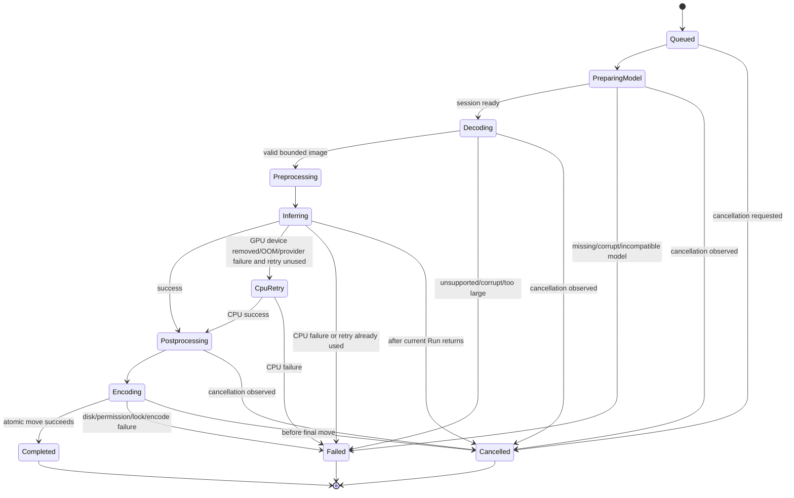

# Failure and fallback state machine

Every terminal result carries `ProcessingOutcome`, a localized-message key, stable log code, category, and retryability. UI receives no native stack trace. Logs receive the exception and sanitized context.

Expected file, model, provider, and cancellation failures are converted at their layer boundary. Truly unexpected exceptions are logged and rethrown to the global exception handlers; handlers do not silently swallow process corruption. Phase 2 implements both provider-initialization fallback and the explicit one-use GPU-to-CPU runtime edge. The failed GPU lease is invalidated and disposed before CPU acquisition.
